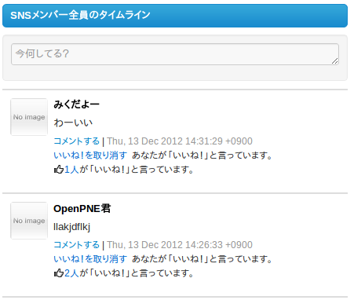
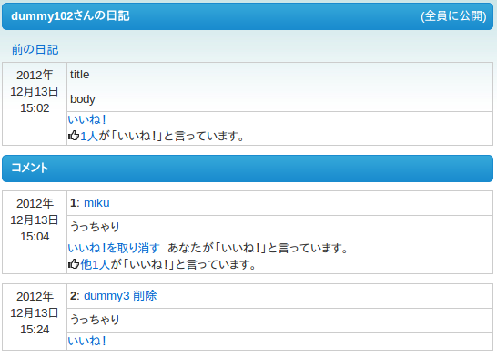
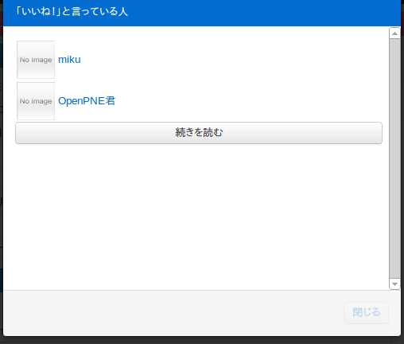
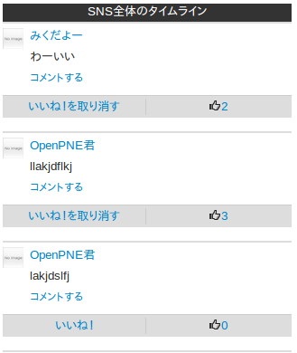
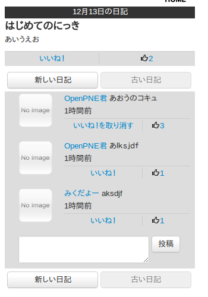
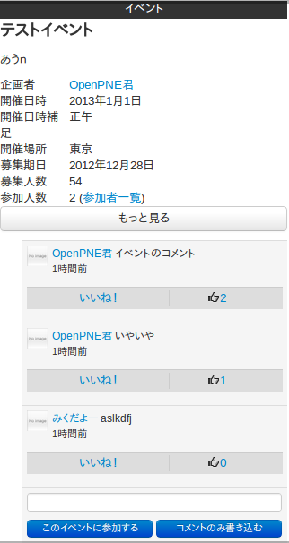
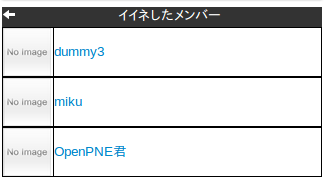

opLikePlugin概要
======================
「いいね！」機能を追加します。

「いいね！」をクリックするといいね！が付きます。
自分のつけた「いいね！」は「いいね！を取り消す」をクリックすることで取り消すことができます。

スマートフォンにも対応しています。

## スクリーンショット

### PC

#### タイムライン

#### 日記

#### いいね！をしたメンバー一覧

### スマートフォン

#### タイムライン

#### 日記

#### コミュニティイベント

#### いいね！をしたメンバー一覧

対応プラグイン
-------------
opTimelinePlugin
opDiaryPlugin
opCommunityTopicPlugin

注意
----
ver1.0.5以前ではmigrateを２回以上行うとエラーが発生する状態でした。
var1.1.0以降ではそのエラーを避けるためにDB構造を変更し、migrateスクリプトを削除致しました。
以上のことからver1.0.5とver1.1.0の互換性は無く、migrateコマンドでの移行は出来ません。
申し訳ありません。

消すことの出来ないデータがあり、移行が必要な場合はmysqldump等で退避し手動で入れなおして下さい。

インストール方法
----------------
**「いいね！」プラグラインのダウンロード**
symfonyコマンドを使って、直接DLします。

    cd path/to/OpenPNE
    ./symfony opPlugin:install opLikePlugin -r 1.2.5

**「いいね！」に対応したプラグインのダウンロード**

    cd path/to/OpenPNE
    ./symfony opPlugin:install opCommunityTopicPlugin -r 1.1.2.1
    ./symfony opPlugin:install opDiaryPlugin -r 1.5.1.1
    ./symfony opPlugin:install opTimelinePlugin -r 1.2.6.1

**CSSの編集**
 ‘OpenPNE ディレクトリ'/web/css/bootstrap.cssを開き、以下の3行を追加

    .icon-thumbs-up {
      background-position: -96px -144px;
    }

**プラグインのインストール**

    ./symfony openpne:migrate
    ./symfony plugin:publish-assets
    ./symfony opLike:addtags
    ./symfony cc

動作環境
--------
OpnePNE3.8.0以上

更新履歴
--------

https://github.com/tejimaya/opLikePlugin/commits/master

要望・フィードバック
----------

https://redmine.openpne.jp/projects/plg-like
